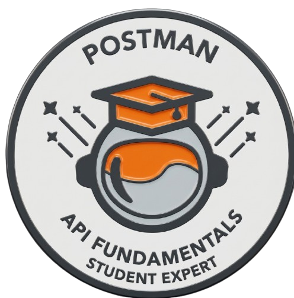
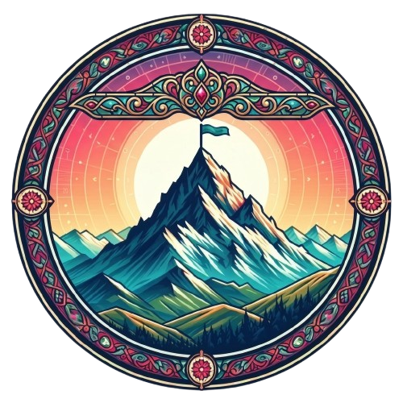
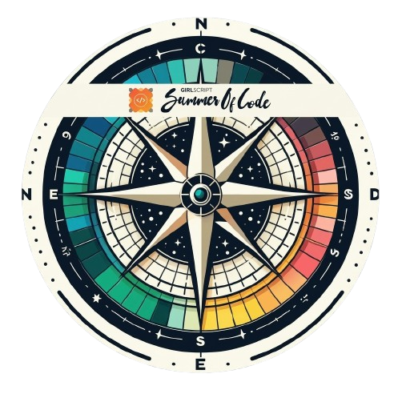
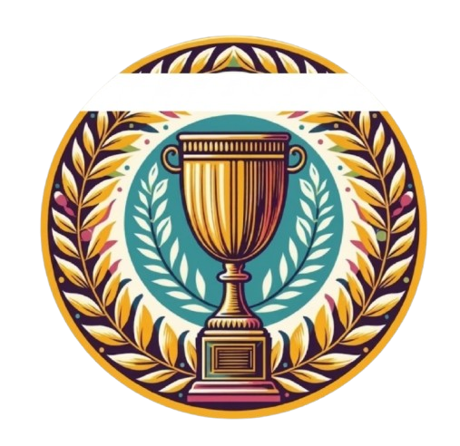

<!-- Animated Header with Waving Gradient -->

---

<!-- About Me Section with Animated Elements -->

## 👋 About Me

### 🎓 BTech Computer Science & Engineering | Final Year | NIT Manipur

 

💻 **Full-Stack Developer** specializing in the **MERN Stack**  
🤖 Working on **AI-powered enterprise workflow automation**  
☁️ Exploring **Azure, Generative AI & Intelligent Systems**  
🧠 Passionate about **Software Engineering, Cloud & Open Source**

 

 

## 🚀 Highlights

 🏢 **Technical Consultant Intern @ Microsoft** — working on AI-powered enterprise workflow automation using **Azure AI Foundry, Microsoft Graph APIs, WorkIQ MCP, Microsoft Teams & Excel**
* 🏆 **Finalist — Microsoft Intern Hackathon**
* 🥇 **Rank #21 | Top 1% — GirlScript Summer of Code 2025** with **75+ merged PRs** & received a **Letter of Recommendation**
* 🌟 **Super Contributor — Hacktoberfest 2025** with **50+ accepted PRs**
* 📚 **Qualified GATE (Graduate Aptitude Test in Engineering)**
* ☁️ **Microsoft Credentials:** AZ-900, AI-900, SC-900 & AB-730

---

  
<!-- Tech Stack Section -->

##  Tech Stack

### Programming Languages

### Frontend Development

### Backend & Database

### Cloud, AI & Microsoft Technologies

### Tools & DevOps

---

## 📊 GitHub Stats

---
## 🏆 Achievements & Recognition

### Hacktoberfest 2025

*🏆 Super Contributor — 50+ Accepted PRs*

###  GirlScript Summer of Code 2025

  <i>🏆 Top 1% Contributor — Rank 21 &nbsp; | &nbsp; 📅 July–October 2025</i>

  
  
  
  
  
  

---
## 📫 Connect With Me

**📧 Email**: sakshigupta678a@gmail.com  
**🎓 Institution**: National Institute of Technology, Manipur  
**💼 Open for**: Collaborations, Projects, and Learning Opportunities

 

---
